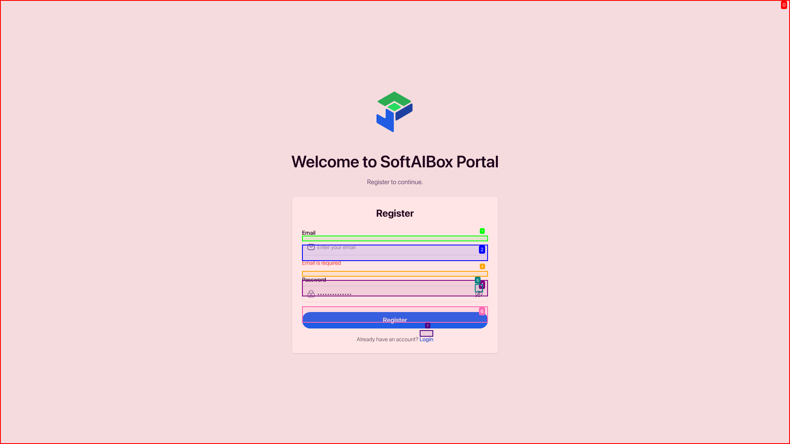

### 📊 Overview
- ✅ Automation completed successfully; the registration test case passed as expected.
- **Feature Executed:** Registering with an empty email field.
- **Final Output:** The system correctly displayed the 'Email is required' message.
- **Detail:** The test case passed successfully, confirming proper validation was implemented.
  
*Error message displayed – "Email is required"*

### 📋 Criteria Report

| Criteria                                             | Status |
|------------------------------------------------------|--------|
| Navigate to registration page                         | ✅ Pass |
| Enter a valid password while leaving the email empty | ✅ Pass |
| Confirm 'Email is required' message is displayed     | ✅ Pass |