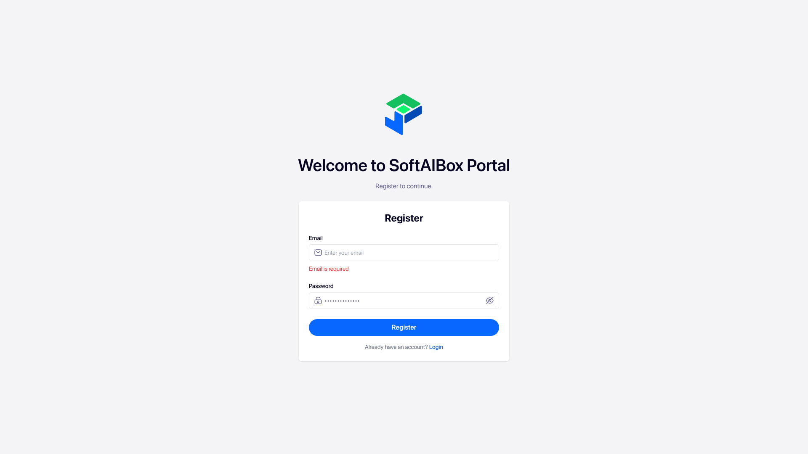

### 📊 Overview
- ✅ Automation completed successfully based on the execution of the registration feature with an empty email.
- **Feature Executed:** Registration with empty email  
- **Final Result:** The system correctly displayed the error message: "Email is required".
- **Duration:** 8.83 seconds
- **Tokens Used:** Approximately 8041
  
*Error message displayed when attempting to register with an empty email.*

### 📋 Criteria Report

| Criteria                                               | Status |
|--------------------------------------------------------|--------|
| Access registration page successfully                   | ✅ Pass |
| Input valid password into the respective field         | ✅ Pass |
| Attempt to register with an empty email field          | ✅ Pass |
| Verify correct error message is displayed               | ✅ Pass |